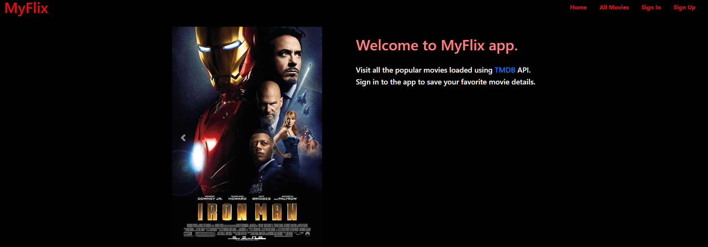

# Myflix 

#### This is a simple Node JS based web app which I have built to to show basic CRUD operations. 
#### App loads the popular movies data using the [The Movie Database](https://developer.themoviedb.org/docs/getting-started) API. The app supports the session based authentication and allows logged in users to save favorite movies, update notes , delete app operations. 

## Live Demo
#### Check [here](https://myflix-ejs-7ead97899eae.herokuapp.com/) 

## Technologies Used
* Node JS
* Embeded JavaScript (EJS) Templates
* HTML/CSS
* Bootstrap Stylesheet
* MongoDB

## Attributions
App loads data using [The Movie Database](https://developer.themoviedb.org/docs/getting-started) API.

## Getting Started
* Clone the app using command, 
`git clone https://github.com/pshegde123/myflix_crud_app.git`

* Install the node packages  using `npm i` command
* Start the app using `nodemon` command.
* Check the url `http://localhost:3000`

## Next Steps
* Implement 'Load More' functionality for the 'All Movies' page
* Display genre and certification details for each movie
* Fix styling issues on 'My Favorites' page.